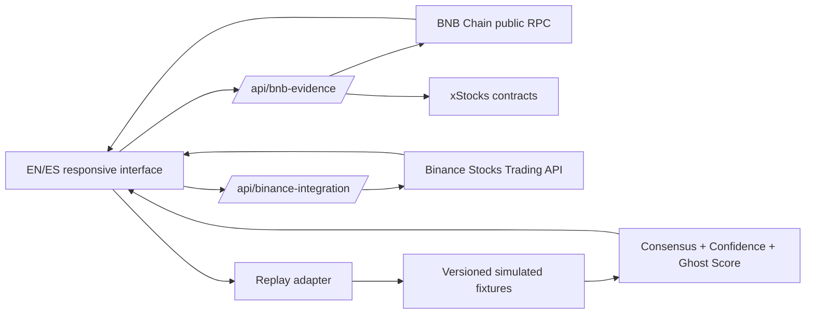

# Ghost Market — BNB Hackathon Beta 0.5

Ghost Market explains what can happen to tokenized-stock markets while Wall Street is closed. It combines verifiable BNB Smart Chain contract evidence with a deterministic replay that demonstrates consensus, confidence, anomaly handling, research, scenarios and a next-morning comparison.

The product deliberately separates truth from theater: `LIVE` is fetched from a verifiable source during the request; `SIMULATED`/`DEMO` is fixture data; `UNAVAILABLE` means credentials or a production adapter are missing.

## What is real today

| Capability | Status | Provenance |
| --- | --- | --- |
| Selected AAPLx, NVDAx or TSLAx contract | LIVE when RPC succeeds | BSC public JSON-RPC: bytecode, decimals, total supply and latest block |
| Binance Stocks Trading asset and quote | LIVE only with `BINANCE_API_KEY` | Official Binance Developer API |
| Three market venues, liquidity and activity | SIMULATED | Versioned replay fixtures |
| Ghost Consensus, Confidence and Score | DETERMINISTIC | Pure calculations over the replay fixtures |
| Break the Consensus stress test | DEMO | Controlled outlier injection and reweighting |
| Ghost Council, Pulse, Research and scenarios | SIMULATED | Deterministic UI narratives; not autonomous agents |
| DEX price, liquidity and execution route | UNAVAILABLE | No verified pool/oracle adapter configured |
| Wallet Skill, ERC-8004 identity, persistent agent | NOT IMPLEMENTED | No claim of agentic execution |

## Architecture



The adapter boundary lets a future verified venue/oracle implementation replace replay fixtures without rewriting the interface or analytical engine.

## Contracts verified

- AAPLx: `0x9d275685dc284c8eb1c79f6aba7a63dc75ec890a`
- NVDAx: `0xc845b2894dBddd03858fd2D643B4eF725fE0849d`
- TSLAx: `0x8ad3c73f833d3f9a523ab01476625f269aeb7cf0`
- BNB Smart Chain mainnet, chain ID `56`

Verification uses `eth_getCode`, `eth_call` for `decimals()` and `totalSupply()`, plus `eth_getBlockByNumber`. A failure becomes `ERROR`; it is never replaced with a fabricated value.

## Binance integration

The server adapter calls `GET /sapi/v1/equity/market/tokenized-assets` and `GET /sapi/v1/equity/market/quote?symbol=<SYMBOL>`. Copy `.env.example` to `.env.local` and add a valid server-side API key:

```dotenv
BINANCE_API_KEY=your_server_side_key
```

The key is never sent to the browser. Missing credentials, invalid credentials, timeout, rate limit, empty response, unsupported asset and upstream failure have explicit states.

## Run and verify

Node.js `>=22.13.0` is required.

```bash
npm run install:ci
npm test
npm run build
npm run dev
```

## Four-minute judge demo

1. **0:00–0:30 — Thesis.** Read the hero, point to the selected xStock/BSC proof and explain the status vocabulary.
2. **0:30–1:15 — Evidence.** Open Integration Proof, follow BscScan contract/block links, and show Binance as LIVE only if the key is configured.
3. **1:15–2:10 — Intelligence.** Open Ghost Brain and Ghost Score. Show deterministic consensus and the labeled unconfirmed hypothesis.
4. **2:10–2:55 — Break the Consensus.** Inject the demo outlier and show the weaker source losing influence.
5. **2:55–3:25 — Research.** Ask for the strangest anomaly; the answer identifies DEMO VENUE B and cites its spread.
6. **3:25–4:00 — Morning After.** Compare overnight consensus with the simulated open, then finish on the system path and limits.

## Hackathon readiness

- [x] Clear first-screen thesis and guided tour
- [x] EN/ES, Simple/Pro and responsive navigation
- [x] Verifiable BSC contract/block evidence
- [x] Honest LIVE, SIMULATED and UNAVAILABLE provenance
- [x] Deterministic outlier demo with cleanup
- [x] Consistent Ghost Score calculation across assets
- [x] Build and engine/error tests
- [ ] Configure `BINANCE_API_KEY` in hosting for live Binance quote proof
- [ ] Add a verified DEX/oracle adapter for price and liquidity
- [ ] Add Wallet Skill / ERC-8004 proof if entering an agent track
- [ ] Publish a public GitHub repository and attach the Developer Experience Report

## Developer Experience Report template

- **Integration attempted:** BNB Chain public RPC and Binance Stocks Trading Market Data
- **What worked:** contract/block reads, server-only API boundary, explicit error taxonomy
- **Friction:** endpoint/auth assumptions, credential provisioning, symbol mapping
- **Errors observed:** include HTTP status, request ID and timestamp; never include the API key
- **Suggested improvements:** minimal quote example, response schemas and sandbox behavior
- **Reproduction:** Node version, commit SHA, symbol, endpoint and UTC timestamp

## Safety

Ghost Market is analytical software, not financial advice. The replay, scores, council, social narrative, research and morning open are simulations and may be wrong. The beta cannot create or submit transactions.
