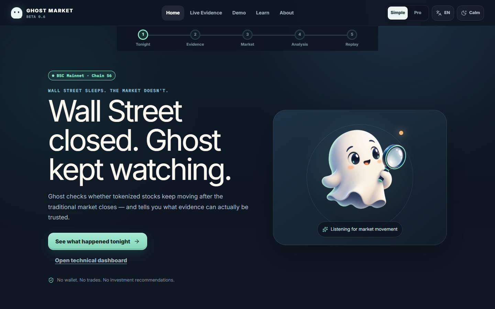
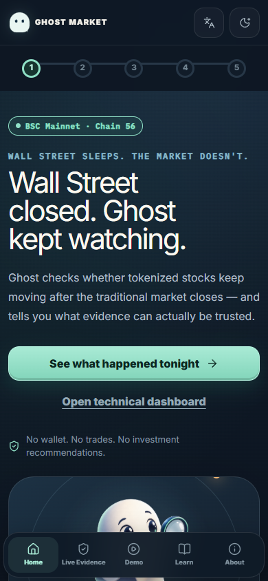

# Ghost Market — BNB Hackathon Beta 0.6

Ghost Market answers one question: **when Wall Street is closed, what does an independently verifiable blockchain market say a tokenized stock is worth?**

It is market-intelligence software, not a trading app, price forecast or investment recommendation.

- [Public deployment](https://ghost-market-beta.lorgiogc.chatgpt.site/)
- [36-second product walkthrough](https://ghost-market-beta.lorgiogc.chatgpt.site/ghost-market-demo.webm)

## Guided experience

Beta 0.6 is organized as a calm, mobile-first learning journey instead of a dense terminal:

- one primary action per step and a visible comprehension path;
- plain-language evidence checks before technical detail;
- Simple and Pro views backed by the same underlying data;
- complete English and Spanish controls, plus Calm Mode and reduced-motion support;
- a clearly gated deterministic demo with eight chapters, including Break the Consensus and The Morning After;
- resilient `UNAVAILABLE` states when a live provider is incomplete or unreachable.





## Why BNB Chain

The selected xStocks exist as BEP-20 contracts on BNB Smart Chain, where contracts, pools, reserves and blocks can be inspected without trusting the interface. Ghost Market uses that transparency to separate four questions that dashboards often collapse into one:

1. Does the contract exist?
2. Does the official provider map this symbol to that contract?
3. Is there a real on-chain market?
4. Is that market liquid and fresh enough to use?

## Product modes

### LIVE EVIDENCE

- Official xStocks Assets API for contract and issuer provenance.
- xStocks trading-period metadata and provider-cached reference quote.
- xStocks BSC oracle metadata.
- BNB public JSON-RPC for bytecode, symbol, total supply and block proof.
- PancakeSwap V2 factory/pair reads for real reserves, price, estimated liquidity and $100 price impact.
- Binance Stocks Trading Market Data through a server-only API key.
- Binance Web3 RWA Data API through a separate server-only API Key + Secret Key pair and HMAC-SHA256 signing.
- Official Binance Wallet Skill `binance-tokenized-securities-info` v1.1 through public read-only endpoints; Ondo identity and multiplier data stay separate from xStocks.

The primary LIVE AFTER-HOURS GAP remains blank unless the traditional market is outside regular hours, Binance returns a valid reference and an on-chain market passes liquidity/impact controls.

### DETERMINISTIC DEMO

Ghost Brain, Ghost Council, Ghost Score, Ghost Consensus, Market Constellation, Break the Consensus, scenarios, research, replay and The Morning After use versioned simulated fixtures. They demonstrate how the analysis behaves; they are not evidence of current or predictive market performance.

## Status vocabulary

| Status | Meaning |
| --- | --- |
| LIVE | Read during the request from a verifiable source |
| CACHED | Real provider data without request-time freshness proof |
| REJECTED | Real observation that failed market-quality controls |
| UNAVAILABLE | Required source, credential, pool or value is missing |
| SIMULATED | Versioned deterministic fixture |

## Real integrations

| Capability | Source | Current behavior |
| --- | --- | --- |
| Contract provenance | xStocks public Assets API | Verifies provider, ISIN and BSC deployment |
| Contract state | BNB public JSON-RPC | Reads code, symbol, supply, block and timestamp |
| Oracle provenance | xStocks public Oracles API | Displays Chainlink pull-feed metadata when returned |
| Reference quote | xStocks `price-data` | Labeled CACHED because the payload has no source timestamp |
| DEX market | PancakeSwap V2 factory/pair | Accepts only with ≥$1,000 liquidity and ≤2% $100 impact |
| Traditional quote | Binance Stocks Trading API | Authenticated HTTP 200 for AAPL, NVDA and TSLA; quote is CACHED because the payload has no source timestamp |
| RWA search, token/reference price and market status | Binance Web3 RWA Data API | Signed request reaches Binance, but provider returns business code `40304`; status is ERROR, never simulated |

## Contracts

- AAPLx: `0x9d275685dc284c8eb1c79f6aba7a63dc75ec890a`
- NVDAx: `0xc845b2894dbddd03858fd2d643b4ef725fe0849d`
- TSLAx: `0x8ad3c73f833d3f9a523ab01476625f269aeb7cf0`
- Network: BNB Smart Chain mainnet, chain ID `56`

Runtime verification does not trust this list alone; the official xStocks registry must return the same BSC address and on-chain `symbol()` must match.

## Binance server configuration

The integration uses the official documented `MARKET_DATA` endpoints:

- `/sapi/v1/equity/market/tokenized-assets`
- `/sapi/v1/equity/market/quote?symbol=<SYMBOL>`
- `/sapi/v1/equity/market/exchangeInfo?symbol=<SYMBOL>`

Set the API key only in the deployment environment:

```dotenv
BINANCE_API_KEY=
BINANCE_WEB3_API_KEY=
BINANCE_WEB3_SECRET_KEY=
```

The key is never returned to the browser. Missing credentials, invalid credentials, rate limits, timeout, unsupported asset, empty quote and upstream failures have explicit states.

Copy `.env.example` to a local `.env` only for development. For the public Site, configure secrets in the Site runtime environment-variable settings and redeploy. `BINANCE_API_KEY` belongs to Stocks Trading; `BINANCE_WEB3_API_KEY` and `BINANCE_WEB3_SECRET_KEY` must be issued by the separate Binance Web3 Developer Portal. Never prefix any of them with `NEXT_PUBLIC_`.

Verify Stocks Trading at `/api/binance-integration?symbol=AAPL`, signed Web3 RWA at `/api/binance-web3-rwa?symbol=AAPL`, and the public Wallet Skill adapter at `/api/binance-wallet-skill?symbol=AAPL`. See [Binance Web3 RWA technical evidence](docs/BINANCE_WEB3_RWA_TECHNICAL_EVIDENCE.md) and [Wallet Skill evidence](docs/BINANCE_WALLET_SKILL_EVIDENCE.md).

| Safe state | Meaning |
| --- | --- |
| `MISSING_CREDENTIALS` | The server secret is absent; no upstream request is attempted |
| `INVALID_CREDENTIALS` | Binance rejected the key |
| `PROVIDER_BLOCKED` | Binance's network edge blocked one or more server hosts; official alternates are retried |
| `RATE_LIMITED` | Binance returned a rate-limit response |
| `TIMEOUT` | The seven-second request budget expired |
| `ASSET_NOT_FOUND` | The requested/returned asset is unsupported or inconsistent |
| `EMPTY_RESPONSE` | A mandatory quote body was empty |
| `PROVIDER_ERROR` | The payload was malformed, mismatched or the provider failed |

## Local verification

Requires Node.js `>=22.13.0`.

```bash
npm run install:ci
npm test
npm run lint
npm run build
npm run dev
```

Recommended functional checks:

1. Select AAPL, NVDA and TSLA in LIVE EVIDENCE.
2. Confirm official registry, BscScan and block links change with the asset.
3. Confirm weak/absent PancakeSwap markets are rejected, not scored as live prices.
4. Confirm missing Binance credentials never become LIVE.
5. Switch to DETERMINISTIC DEMO and test Simple/Pro, EN/ES, Research, scenarios, Break the Consensus, replay and The Morning After.
6. Test 320, 375, 390, 768 px and desktop without horizontal scroll.

## Technical documentation

- [Architecture](docs/ARCHITECTURE.md)
- [Contracts and provenance](docs/CONTRACTS.md)
- Developer Experience Report: pending the author’s personal review and approval; not generated by the application
- [License](LICENSE)

## Reproducible market audit

Run `node scripts/audit-candidate-markets.mjs` to inspect official SPYx and QQQx BSC native/wrapper deployments against PancakeSwap V2 USDT and USDC. The script does not lower the production gates or mutate product configuration. At BSC block `126,528,816`, no candidate passed: the only discovered SPYx/USDC pair had approximately $0.00247 liquidity and 8,094,882.87% estimated impact for $100; QQQx returned no checked pair.

## Hackathon verification checklist

- [x] LIVE EVIDENCE and DETERMINISTIC DEMO are visually and logically separate.
- [x] AAPLx, NVDAx and TSLAx provenance is checked against the official xStocks registry.
- [x] Contract bytecode, symbol and block evidence are read from BSC mainnet.
- [x] Weak/absent PancakeSwap markets are rejected at fixed thresholds.
- [x] Session status is normalized; the live gap is paused during `OPEN`.
- [x] Wallet/agent/transaction features are explicitly `NOT IMPLEMENTED`.
- [x] Binance credentials remain server-only and failures are isolated.
- [x] Authenticated Binance Stocks transport success — HTTP 200 verified for AAPL, NVDA and TSLA; price freshness remains CACHED.
- [ ] Usable Binance Web3 response — signed requests currently return business code `40304`.
- [ ] Accepted on-chain xStock market — none found in the audited V2 routes.
- [ ] Public repository URL — the reviewed repository exists at `https://github.com/ErickAmestegui/ghost-market` and remains private until the owner explicitly approves the visibility change.
- [x] Demo video URL — hosted with the public Site and verified at 36.92 seconds.
- [x] Anonymous public site access — explicitly authorized by the owner and published through Sites.

## Current limitations

- Production Binance credential names are configured as server-only Sites secrets; their values are hidden and never returned to the browser.
- Binance Web3 currently returns HTTP 200 with business code `40304` (`Service not available due to compliance restriction`) for both RWA Platforms and Market Supported Chains. Ghost Market exposes this as an error and makes no LIVE claim.
- The observed AAPLx and TSLAx PancakeSwap V2 pools are below the acceptance threshold; NVDAx has no verified V2 USDT pair. The live gap therefore remains incomplete.
- No connected wallet, transaction, ERC-8004 identity or persistent agent is implemented. The Binance Wallet Skill integration is read-only and creates no signatures or transactions.
- The GitHub repository is configured and synchronized privately. Its history, current tree and compiled bundles must pass the final secret review before the owner explicitly authorizes public visibility.

## Safety

Ghost Market does not execute trades or predict future prices. Scenario weights are analytical demo estimates, not forecasts or investment probabilities. Historical simulated nights are not proof of accuracy.
